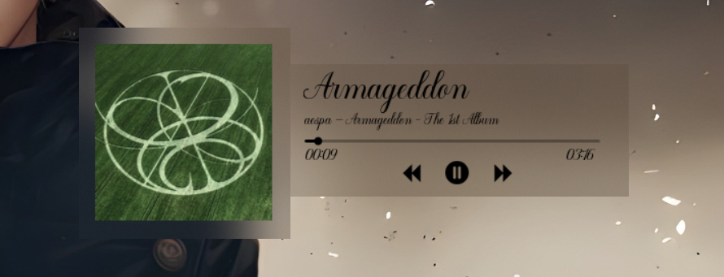

# Elegant Album Art - Rainmeter Skin

A minimalist, high-performance media skin designed for seamless **System Integration** with Spotify and other web-based players. This project emphasizes clean **UI/UX Customization** through advanced visual effects.

## 🚀 Key Features
* **Metadata Integration:** Real-time fetching of album art and track information using the **WebNowPlaying API**.
* **Visual Refinement:** Implements a native Windows 11 aesthetic using the **FrostedGlass plugin** for real-time background blur.
* **Logic Tuning:** Optimized coordinate mapping for dynamic layout responsiveness across various resolutions.
* **Interactive UI:** Includes custom drag-and-resize functionality with event-driven script refinement.

## 🛠️ Built With
* **Rainmeter** (Engine)
* **Lua** (Scripting & Logic)
* **WebNowPlaying Plugin** (Media Sync)
* **FrostedGlass Plugin** (Visual Effects)

## 📸 Preview

## 🔧 Installation
1. Ensure **Rainmeter** is installed on your system.
2. Clone or download this repository into your `Skins` directory.
3. Install the required **WebNowPlaying** and **FrostedGlass** plugins.
4. Load the skin through the Rainmeter Manager.